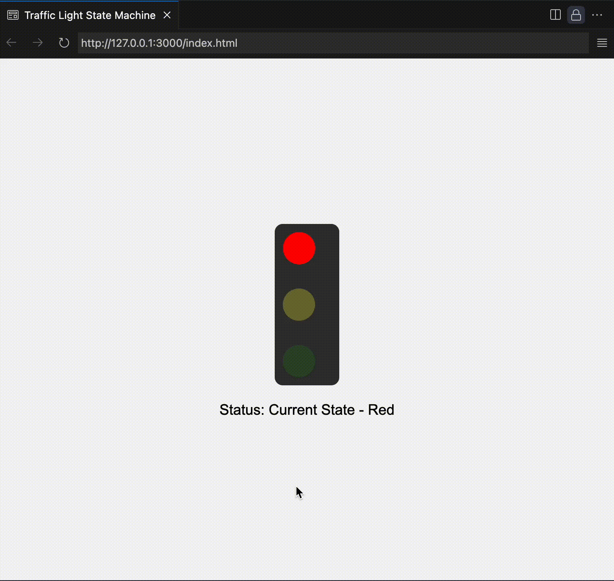

## Problem Statement 
Implementation Related to State Machines:
Implement a state machine to manage the state of a traffic light system.
Write the code for traffic light state machine with states like “Green,” “Yellow&amp;quot;,
&amp;quot;Red” and transitions between these states.How would you handle
asynchronous actions within a state machine? Provide examples of handling
asynchronous actions (like API calls) within a state
machine using JavaScript.

# Demo 


# Implementation with Explanation


### 1. **Class `TrafficLightWithAsync`**
The entire logic of the traffic light system is encapsulated in the class `TrafficLightWithAsync`. This class contains:
- **States**: The traffic light can be in three possible states: `"Red"`, `"Green"`, and `"Yellow"`.
- **Current State**: It keeps track of the current state of the traffic light. Initially, it is set to `"Red"`.
- **DOM Elements**: The class interacts with the DOM to update the visual appearance of the traffic light. It uses `document.getElementById()` to access the red, yellow, and green light elements by their `id` attributes.

### 2. **Constructor**
The constructor is called when a new instance of the class is created. It performs the following tasks:
- Initializes the three possible states in an array: `["Green", "Yellow", "Red"]`.
- Sets the initial state to `"Red"`.
- Fetches the elements representing the lights (`redLight`, `yellowLight`, and `greenLight`) and the status display (`statusDisplay`).
- Calls the `updateLights()` method to visually set the initial state (i.e., activate the red light).

```javascript
constructor() {
    this.states = ["Green", "Yellow", "Red"];
    this.currentState = "Red"; // Initial state
    this.redLight = document.getElementById("red-light");
    this.yellowLight = document.getElementById("yellow-light");
    this.greenLight = document.getElementById("green-light");
    this.statusDisplay = document.getElementById("status");
    this.updateLights(); // Set the initial light
}
```

### 3. **`transition()` Method**
This method handles the state transitions. Every time it's called, it:
- Checks the current state using a `switch` statement.
- If the current state is `"Red"`, it calls the `handleRedState()` method (which is asynchronous) before moving to the `"Green"` state.
- If the current state is `"Green"`, it moves to `"Yellow"`.
- If the current state is `"Yellow"`, it moves back to `"Red"`.

The `updateLights()` method is called to update the DOM and visually reflect the current state.

```javascript
async transition() {
    switch (this.currentState) {
        case "Red":
            await this.handleRedState(); // Asynchronous state handling
            this.currentState = "Green";
            break;
        case "Green":
            this.currentState = "Yellow";
            break;
        case "Yellow":
            this.currentState = "Red";
            break;
        default:
            throw new Error("Invalid state");
    }
    this.updateLights(); // Update the DOM to reflect the state change
    console.log(`Transitioned to: ${this.currentState}`);
}
```

### 4. **`updateLights()` Method**
This method updates the appearance of the traffic light by adding or removing the `active` class to/from the correct light (`red`, `yellow`, or `green`). The `active` class makes the light appear "on" by increasing its opacity.

- First, it removes the `active` class from all lights.
- Then, based on the current state, it adds the `active` class to the correct light.
- It also updates the status text on the page to show which state the traffic light is currently in.

```javascript
updateLights() {
    this.redLight.classList.remove("active");
    this.yellowLight.classList.remove("active");
    this.greenLight.classList.remove("active");

    switch (this.currentState) {
        case "Red":
            this.redLight.classList.add("active");
            break;
        case "Yellow":
            this.yellowLight.classList.add("active");
            break;
        case "Green":
            this.greenLight.classList.add("active");
            break;
    }

    this.statusDisplay.textContent = `Status: Current State - ${this.currentState}`;
}
```

### 5. **`handleRedState()` Method (Asynchronous Action)**
This is an asynchronous method that simulates an API call (or any asynchronous task). Here's how it works:
- It updates the status display to indicate that it's handling the `"Red"` state and performing an asynchronous task.
- It simulates an API call using `setTimeout()`, which introduces a 2-second delay to mimic the behavior of an API call.
- After the "API call" completes, it logs that the call is done and updates the status display.

```javascript
async handleRedState() {
    this.statusDisplay.textContent = "Status: Handling Red State... (API call)";
    console.log("Handling Red state asynchronously...");
    
    // Simulate an asynchronous API call
    await new Promise(resolve => setTimeout(resolve, 2000)); // Simulate 2 second delay
    console.log("Simulated API call completed.");

    this.statusDisplay.textContent = "Status: API call completed. Transitioning...";
}
```

### 6. **`run()` Method**
This method controls the timing of the state transitions. It uses `setInterval()` to call the `transition()` method every 3 seconds, making the traffic light change states automatically at regular intervals.

```javascript
run() {
    setInterval(() => this.transition(), 3000); // Transition every 3 seconds
}
```

### 7. **Main Script**
Finally, a new instance of the `TrafficLightWithAsync` class is created and the `run()` method is called to start the state transitions.

```javascript
const trafficLightWithAsync = new TrafficLightWithAsync();
trafficLightWithAsync.run();
```

---

### Key Concepts:

- **State Management**: The traffic light system is managed using a state machine. Each state ("Red", "Yellow", "Green") has specific logic for transitioning to the next state.
  
- **Asynchronous Actions**: During the "Red" state, an asynchronous task (simulated with `setTimeout()`) is performed before transitioning to the next state. This could be an API call or any other async operation in a real-world scenario.

- **DOM Manipulation**: The `updateLights()` method directly manipulates the DOM by adding or removing CSS classes to control which light is "on" or "off".
